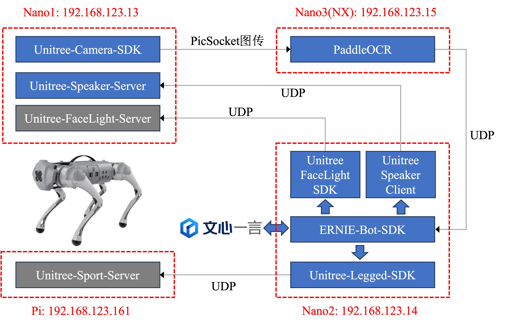

# ERNIE-Dog：基于文心一言大模型的机器狗

<div align="center">

</div>

第十三届“中国软件杯”大学生软件设计大赛百度飞桨赛题官方Baseline。

> GitHub仓库地址：https://github.com/BestAnHongjun/ERNIE-Dog \
> Gitee仓库地址：https://gitee.com/an_hongjun/ERNIE-Dog

Baseline整体架构：

<div align="center">

</div>

## 一、DEMO运行准备

### 1.Go1-Nano1环境配置

<details>
<summary>1.1 下载代码仓库(编写中)</summary>

```sh
# 下载到home目录
cd ~

# 克隆Git仓库
git clone https://github.com/BestAnHongjun/ERNIE-Dog.git

# 如遇到网络问题，可由Gitee码云平台下载
# git clone https://gitee.com/an_hongjun/ERNIE-Dog.git
```

</details>

<details>
<summary>1.2 编译安装PicSocket图传</summary>

下载PicSocket代码仓库。

```sh
# 下载PicSocket到home目录
cd ~

# 克隆Git仓库
git clone https://github.com/BestAnHongjun/PicSocket.git

# 如遇到网络问题，可由Gitee码云平台下载
# git clone https://gitee.com/an_hongjun/PicSocket.git
```

切换到v0.0.1分支。
```sh
cd ~/PicSocket
git checkout v0.0.1
```

编译并安装。
```sh
cd ~/PicSocket
mkdir build
cd build
cmake ..
make -j4 
make install
```

执行完上述命令后，会将PicSocket相关组件安装到`~/PicSocket/install`文件夹。

</details>

<details>
<summary>1.3 编译安装Unitree相关SDK</summary>

编译安装宇树相机SDK

```sh
# 进入项目主目录
cd ~/ERNIE-Dog

# 执行一键编译安装脚本
./Go1_Bot/build_camera_sdk.sh
```

</details>

### 2.Go1-Nano2环境配置

<details>
<summary>2.1 在Go1-Nano2板卡上创建conda环境</summary>

安装Miniconda。
> **关于为什么要装`Miniconda`**：调用文心一言`ERNIE-Bot`时需要安装`erniebot`包，该包要求的最低Python解释器版本为`Python>=3.8`，而`Go1-Nano2`预装的Python解释器版本为3.6，同时为了避免后续过程的其他麻烦（比如环境依赖冲突），因此安装`Miniconda`。*PS:有佬有其他solution可以用自己的方法，本`baseline`面向各水平广大群体。*

```sh
# 创建文件夹
mkdir -p ~/miniconda3

# 下载最新的Miniconda安装包
wget https://repo.anaconda.com/miniconda/Miniconda3-latest-Linux-aarch64.sh -O ~/miniconda3/miniconda.sh
```

> 如果在Go1板卡上遇到HTTPS证书相关问题问题，一般是由系统时间不准确导致的，执行如下指令自动同步系统时间：
```sh
sudo ntpdate ntp.aliyun.com
```
**记得每次开机都执行上述命令同步时间**。当你遇到不限于以下问题时，都有可能是时间问题导致的：
* 通过wget、git、curl等下载文件失败，通常涉及https协议握手；
* CMake编译失败。表现为命令行中好像已经编译完成了，但实际上没有更新二进制文件。因为CMake会比较缓存中的二进制文件和新生成的二进制文件的时间，如果编译目录中存在一个“未来“的文件，它会认为你已经编译成功了。

```sh
# 安装Miniconda
bash ~/miniconda3/miniconda.sh -b -u -p ~/miniconda3

# 删除安装包
rm -rf ~/miniconda3/miniconda.sh

# 初始化Miniconda环境
~/miniconda3/bin/conda init bash
source ~/.bashrc
```

这时你的命令行前面应该有小括号了`(base)`。

```sh
# 创建虚拟环境
conda create -n ernie_dog python=3.10

# 激活虚拟环境
conda activate ernie_dog
```
这时，命令行前面的小括号应该变成`(ernie_dog)`了，表示当前已经进入`ernie_dog`环境。

后面再执行相关代码时，记得确保在`ernie_dog`环境中。尤其是重启终端窗口之后，会默认以基础环境`base`启动。可参考以下命令：

```sh
# 创建新的虚拟环境
conda create -n <your-env-name> python=3.x

# 激活虚拟环境
conda activate <your-env-name>

# 退出虚拟环境
conda deactivate

# 删除虚拟环境
conda remove -n <your-env-name> --all # 慎用，不可逆！
```

</details>

<details>
<summary>2.2 下载代码仓库</summary>

下载Baseline代码仓库

```sh
# 下载到Home目录
cd ~

# 克隆Git仓库
git clone https://github.com/BestAnHongjun/ERNIE-Dog.git

# 如遇到网络问题，可由Gitee码云平台下载
# git clone https://gitee.com/an_hongjun/ERNIE-Dog.git
```

安装依赖项
* 注意确保你已经进入`conda`虚拟环境。

```sh
# 进入仓库主目录
cd ERNIE-Dog

# 安装依赖项
python -m pip install -r requirements-nx.txt
```

</details>

<details>
<summary>2.3 编译安装Unitree相关SDK</summary>

编译安装宇树运动SDK

```sh
# 进入项目主目录
cd ~/ERNIE-Dog

# 执行一键编译安装脚本
./Go1_Bot/build_legged_sdk.sh
```

编译安装宇树灯带SDK

```sh
# 进入项目主目录
cd ~/ERNIE-Dog

# 执行一键编译安装脚本
./Go1_Bot/build_light_sdk.sh
```

</details>

### 3.Go1-Nano3(Go1-NX)环境配置

<details>
<summary>3.1 安装PaddlePaddle-GPU</summary>

下载PaddlePaddle-GPU安装包。

**注意**：该Python包是针对JetPack4.5定制的，小白请勿在`conda`环境中使用。大佬自行使用骚操作解决。

```sh
# 进入下载目录
cd ~/Downloads

# NX版执行如下命令
wget https://paddle-inference-lib.bj.bcebos.com/2.3.2/python/Jetson/jetpack4.5_gcc7.5/xavier/paddlepaddle_gpu-2.3.2-cp36-cp36m-linux_aarch64.whl
# Nano版执行如下命令
wget https://paddle-inference-lib.bj.bcebos.com/2.3.2/python/Jetson/jetpack4.5_gcc7.5/nano/paddlepaddle_gpu-2.3.2-cp36-cp36m-linux_aarch64.whl
```

安装PaddlePaddle-GPU。
```sh
pip3 install paddlepaddle_gpu-2.3.2-cp36-cp36m-linux_aarch64.whl
```

使用vim编辑`~/.bashrc`:

```sh
vim ~/.bashrc
```

在最后一行添加：
```sh
export OPENBLAS_CORETYPE=ARMV8
```

激活环境变量：

```sh
source ~/.bashrc
```

</details>

<details>
<summary>3.2 安装PaddleOCR</summary>

下载PaddleOCR代码仓库。

```sh
cd ~
git clone https://github.com/PaddlePaddle/PaddleOCR
```

切换分支。

```sh
cd ~/PaddleOCR
git checkout release/2.6
```

注意执行`git checkout release/2.6`切换到2.6版本分支。在2.7+版本中，`requirements.txt`中的一项`Pillow>=10.0.0`，`Python3.6`无法支持……

编辑`requirements.txt`，将最后一行`PyMuPDF`注释掉，同时添加一行新的`python-bidi`。

```sh
# PyMuPDF<1.21.0
python-bidi
```

安装依赖项。

```sh
pip3 install -r requirements.txt
```

`pip3 install`这一步耗时比较长，请将狗子充满电进行，或外接电源。

</details>

<details>
<summary>3.3 下载预训练模型</summary>

下载并解压PPOCRv3模型

```sh
cd ~/PaddleOCR
mkdir pretrain_models
cd pretrain_models

wget https://paddleocr.bj.bcebos.com/PP-OCRv3/chinese/ch_PP-OCRv3_det_infer.tar
wget https://paddleocr.bj.bcebos.com/PP-OCRv3/chinese/ch_PP-OCRv3_rec_infer.tar
tar xf ch_PP-OCRv3_det_infer.tar
tar xf ch_PP-OCRv3_rec_infer.tar
```

运行demo测试：

```sh
python3 tools/infer/predict_system.py \
    --det_model_dir=./pretrain_models/ch_PP-OCRv3_det_infer/ \
    --rec_model_dir=./pretrain_models/ch_PP-OCRv3_rec_infer/ \
    --image_dir=./doc/imgs/ \
    --use_gpu=True \
    --rec_image_shape="3,48,320"
```

运行结果将保存于`./inference_results`文件夹下。

</details>


## 二、运行DEMO

<details>
<summary>1.启动Go1-Nano1板卡程序(编写中)</summary>
</details>

<details>
<summary>2.启动Go1-NX板卡程序(编写中)</summary>
</details>

## 三、开发教程

### 1.让机器狗“看”懂指令 - PaddleOCR

[1.1 UnitreeCamera SDK教程(编写中)](#)

[1.2 UnitreeCamera与PaddleOCR集成(编写中)](#)

### 2.让机器狗拥有“大脑” - 文心一言大模型

[2.1 ERNIE-Bot SDK教程](https://aistudio.baidu.com/projectdetail/6779542)

[2.2 ERNIE-Bot SDK进阶教程](https://aistudio.baidu.com/projectdetail/6779597)

[2.3 基于ERNIE-Bot SDK开发Agent](./doc/chapter2.3.md)

### 3.让机器狗“动”起来 - UnitreeSDK

[3.1 如何让狗子的灯带发光](./doc/chapter3.1.md)

[3.2 如何调用狗子的扬声器](./doc/chapter3.2.md)

[3.3 控制狗子运动](./doc/chapter3.3.md)

### 4.工程集成

[4.1 文心大模型与UnitreeSDK集成(编写中)](#)

[4.2 PaddleOCR-文心-UnitreeSDK全链路集成(编写中)](#)

## 开发单位
#### 开发者：
> <big>安泓郡(Coder.AN)</big>： 西北工业大学光电与智能研究院，博士生，https://www.anhongjun.top/about.php

#### 合作单位：


<div align="center">

</div>


