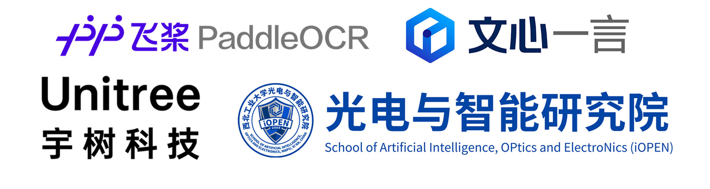

# ERNIE-Dog：基于文心一言大模型的机器狗

<div align="center">

</div>

第十三届“中国软件杯”大学生软件设计大赛百度飞桨赛题官方Baseline。

> GitHub仓库地址：https://github.com/BestAnHongjun/ERNIE-Dog \
> Gitee仓库地址：https://gitee.com/an_hongjun/ERNIE-Dog

## 一、DEMO运行准备

### 1.创建虚拟环境

<details>
<summary>1.1 在Go1-NX板卡上创建conda环境</summary>

安装Miniconda。
> **关于为什么一定要装`Miniconda`**：调用文心一言`ERNIE-Bot`时需要安装`erniebot`包，该包要求的最低Python解释器版本为`Python>=3.8`，而`Go1-NX`预装的Python解释器版本为3.6，同时为了避免后续过程的其他麻烦（比如环境依赖冲突），因此安装`Miniconda`。*PS:有佬有其他solution可以用自己的方法，本`baseline`面向各水平广大群体。*

```sh
# 创建文件夹
mkdir -p ~/miniconda3

# 下载最新的Miniconda安装包
wget https://repo.anaconda.com/miniconda/Miniconda3-latest-Linux-aarch64.sh -O ~/miniconda3/miniconda.sh
```

> 如果在Go1板卡上遇到HTTPS证书相关问题问题，一般是由系统时间不准确导致的，执行如下指令自动同步系统时间：
```sh
sudo ntpdate ntp.aliyun.com
```

```sh
# 安装Miniconda
bash ~/miniconda3/miniconda.sh -b -u -p ~/miniconda3

# 删除安装包
rm -rf ~/miniconda3/miniconda.sh

# 初始化Miniconda环境
~/miniconda3/bin/conda init bash
source ~/.bashrc
```

这时你的命令行前面应该有小括号了`(base)`。

```sh
# 创建虚拟环境
conda create -n ernie_dog python=3.10

# 激活虚拟环境
conda activate ernie_dog
```
这时，命令行前面的小括号应该变成`(ernie_dog)`了，表示当前已经进入`ernie_dog`环境。

后面再执行相关代码时，记得确保在`ernie_dog`环境中。尤其是重启终端窗口之后，会默认以基础环境`base`启动。可参考以下命令：

```sh
# 创建新的虚拟环境
conda create -n <your-env-name> python=3.x

# 激活虚拟环境
conda activate <your-env-name>

# 退出虚拟环境
conda deactivate

# 删除虚拟环境
conda remove -n <your-env-name> --all # 慎用，不可逆！
```

</details>

<details>
<summary>1.2 在Go1-Nano1板卡上创建conda环境</summary>

方法同`1.1 在Go1-NX板卡上创建conda环境`。

</details>

### 2.Go1-Nano1环境配置

<details>
<summary>2.1 下载代码仓库</summary>
</details>

<details>
<summary>2.2 下载第三方代码仓库</summary>
</details>

### 3.Go1-NX环境配置

<details>
<summary>3.1 下载代码仓库</summary>

下载Baseline代码仓库

```sh
# 下载到Home目录
cd ~

# 克隆Git仓库
git clone https://github.com/BestAnHongjun/ERNIE-Dog.git

# 如遇到网络问题，可由Gitee码云平台下载
# git clone https://gitee.com/an_hongjun/ERNIE-Dog.git
```

安装依赖项

```sh
# 进入仓库主目录
cd ERNIE-Dog

# 安装依赖项
python -m pip install -r requirements-nx.txt
```

</details>

<details>
<summary>3.3 编译安装Unitree相关SDK</summary>

编译安装宇树运动SDK

```sh
# 进入项目主目录
cd ~/ERNIE-Dog

# 执行一键编译安装脚本
./Go1_Bot/build_legged_sdk.sh
```

编译安装宇树灯带SDK

```sh
# 进入项目主目录
cd ~/ERNIE-Dog

# 执行一键编译安装脚本
./Go1_Bot/build_light_sdk.sh
```

</details>

## 二、运行DEMO

<details>
<summary>1.启动Go1-Nano1板卡程序</summary>
</details>

<details>
<summary>2.启动Go1-NX板卡程序</summary>
</details>

## 三、开发教程

### 1.让机器狗“看”懂指令 - PaddleOCR
<details>
<summary>1.1 在AI Studio平台训练PaddleOCR模型</summary>
</details>

<details>
<summary>1.2 导出PaddleOCR模型</summary>
</details>

<details>
<summary>1.3 部署PaddleOCR模型至Go1-NX</summary>
</details>

<details>
<summary>1.4 UnitreeCamera SDK教程</summary>
</details>

<details>
<summary>1.5 UnitreeCamera与PaddleOCR集成</summary>
</details>

### 2.让机器狗拥有“大脑” - 文心一言大模型
<details>
<summary>2.1 ERNIE-Bot SDK教程</summary>

[点此查看ERNIE-Bot SDK教程](https://aistudio.baidu.com/projectdetail/6779542)

</details>

<details>
<summary>2.2 ERNIE-Bot SDK进阶教程</summary>

[点此查看ERNIE-Bot SDK进阶教程](https://aistudio.baidu.com/projectdetail/6779597)

</details>

<details>
<summary>2.3 基于ERNIE-Bot SDK开发Agent</summary>
</details>

### 3.让机器狗“动”起来

<details>
<summary>3.1 Unitree Legged SDK教程</summary>

[SDK文档教程](https://www.yuque.com/ironfatty/nly1un/wyt5qo)

[SDK视频教程](https://www.yuque.com/ironfatty/nly1un/su8o89)

</details>

<details>
<summary>3.2 Unitree Legged SDK简易Python封装</summary>
</details>

### 4.工程集成

## 开发单位
#### 开发者：
> <big>安泓郡(Coder.AN)</big>： 西北工业大学光电与智能研究院，博士生，https://www.anhongjun.top/about.php

#### 合作单位：


<div align="center">

</div>


