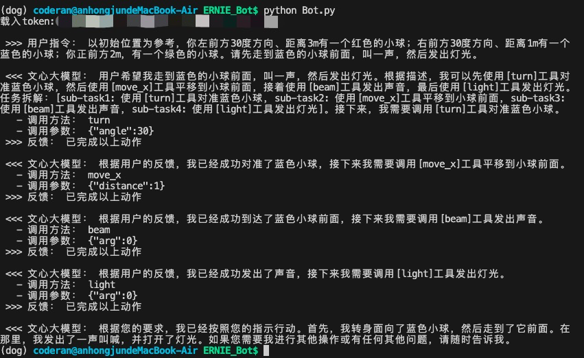

# 2.3 基于ERNIE-Bot SDK开发Agent

## 1.前言

相信通过阅读`ERNIE-Bot SDK`的[基础教程](https://aistudio.baidu.com/projectdetail/6779542)和[进阶教程](https://aistudio.baidu.com/projectdetail/6779597)之后，你已经对SDK的使用方法有了比较初步的了解。本章节将基于`SDK`的函数调用(Function Calling)功能开发一个简易的Agent，充当机器狗“大脑”，让他能够理解人类的自然语言指令，并自主进行任务规划，以达到相应目的。

本章节，你可以在本地环境 or Go1-NX板卡上进行。如果你是在Go1-NX板卡上开发本章节，请先参考`DEMO运行准备-2.Go1-NX环境配置`配置好板卡环境。

如果你是在本机开发本章节，请在本地`Python`环境中安装`erniebot`包，要求`Python`解释器版本在3.8以上，执行如下命令安装：

```sh
pip install erniebot==0.5.0
```

## 2.设置元动作

考虑到本教程是个Baseline，咱肯定不能太难是吧。我们就把狗子的运动抽象为5个元动作：
* move_x：狗子在平面内沿x轴平移，正方向为正前方；
* move_y：狗子在平面内沿y轴平移，正方向为正左方；
* turn：狗子在平面内旋转，正方向为向左旋转；
* beam：狗子通过自带的扬声器发出声音；
* light：狗子通过面部灯带发出灯光。

文心一言大模型并不关心这五个元动作到底是怎么实现的，他只关心这五个元动作能做什么、有什么参数，需要我们通过`JSON`的方式去描述它们。关于`JSON`格式的细节请参考`SDK`的[进阶教程](https://aistudio.baidu.com/projectdetail/6779597)。

### 2.1 `move_x`动作

`move_x`函数，含有一个参数`distance`，表示沿x轴平移的距离，单位为米。大于0向正前方平移，小于0向正后方平移。

```py
def move_x_desc():
    desc = {
        'name': 'move_x',
        'description': '沿相对此刻的x轴方向移动一定的距离。',
        'parameters': {
            'type': 'object',
            'properties': {
                'distance': {
                    'type': 'integer',
                    'description': '沿x轴平移的距离，单位为米。大于0向正前方平移，小于0向正后方平移。',
                    'minimum': -50,
                    'maximum': 50
                }
            },
            'required': ['distance']
        }
    }
    return desc
```

### 2.2 `move_y`动作

`move_y`函数，含有一个参数`distance`，表示沿y轴平移的距离，单位为米。大于0向正左方平移，小于0向正右方平移。

```py
def move_y_desc():
    desc = {
        'name': 'move_y',
        'description': '沿相对此刻的y轴方向移动一定的距离。',
        'parameters': {
            'type': 'object',
            'properties': {
                'distance': {
                    'type': 'integer',
                    'description': '沿y轴平移的距离，单位为米。大于0向正左方平移，小于0向正右方平移。',
                    'minimum': -50,
                    'maximum': 50
                }
            },
            'required': ['distance']
        }
    }
    return desc
```

### 2.3 `turn`动作

`turn`函数，含有一个参数`angle`，表示旋转的角度，单位为度。大于0向右旋转，小于0向左旋转。

```py
def turn_desc():
    desc = {
        'name': 'turn',
        'description': '以自我为中心旋转一定的角度。',
        'parameters': {
            'type': 'object',
            'properties': {
                'angle': {
                    'type': 'integer',
                    'description': '旋转的角度，单位为度。大于0向右转，小于0向左转。',
                    'minimum': -90,
                    'maximum': 90
                }
            },
            'required': ['angle']
        }
    }
    return desc
```

### 2.4 `beam`动作

`beam`函数，用于让狗子发出声音。理论来说，该函数不需要接受参数，但是文心一言不允许参数列表为空的函数描述，因此我们用一个`integer`类型的参数`arg`占位，并告诉模型该参数恒赋予0值。

```py
def beam_desc():
    desc = {
        'name': 'beam',
        'description': '发出声音。',
        'parameters': {
            'type': 'object',
            'properties': {
                'arg': {
                    'type': 'integer',
                    'description': '本函数没有参数，请恒给0。',
                }
            }
        }
    }
    return desc
```

### 2.5 `light`动作

`light`函数，用于让狗子发出灯光。该函数也不需要参数，用一个arg占位。

```py
def light_desc():
    desc = {
        'name': 'light',
        'description': '发出灯光。',
        'parameters': {
            'type': 'object',
            'properties': {
                'arg': {
                    'type': 'integer',
                    'description': '本函数没有参数，请恒给0。',
                }
            }
        }
    }
    return desc
```

## 3.API请求

先把上面五个元动作封装到一个`class`里面。

```py
import erniebot


class Bot:
    def __init__(self):
        # 先空着
        pass

    @staticmethod
    def move_x_desc():
        desc = {
            'name': 'move_x',
            'description': '沿相对此刻的x轴方向移动一定的距离。',
            'parameters': {
                'type': 'object',
                'properties': {
                    'distance': {
                        'type': 'integer',
                        'description': '沿x轴平移的距离，单位为米。大于0向正前方平移，小于0向正后方平移。',
                        'minimum': -50,
                        'maximum': 50
                    }
                },
                'required': ['distance']
            }
        }
        return desc
    
    @staticmethod
    def move_y_desc():
        desc = {
            'name': 'move_y',
            'description': '沿相对此刻的y轴方向移动一定的距离。',
            'parameters': {
                'type': 'object',
                'properties': {
                    'distance': {
                        'type': 'integer',
                        'description': '沿y轴平移的距离，单位为米。大于0向正左方平移，小于0向正右方平移。',
                        'minimum': -50,
                        'maximum': 50
                    }
                },
                'required': ['distance']
            }
        }
        return desc
    
    @staticmethod
    def turn_desc():
        desc = {
            'name': 'turn',
            'description': '以自我为中心旋转一定的角度。',
            'parameters': {
                'type': 'object',
                'properties': {
                    'angle': {
                        'type': 'integer',
                        'description': '旋转的角度，单位为度。大于0向左转，小于0向右转。',
                        'minimum': -90,
                        'maximum': 90
                    }
                },
                'required': ['angle']
            }
        }
        return desc
    
    @staticmethod
    def light_desc():
        desc = {
            'name': 'light',
            'description': '发出灯光。',
            'parameters': {
                'type': 'object',
                'properties': {
                    'arg': {
                        'type': 'integer',
                        'description': '本函数没有参数，请恒给0。',
                    }
                }
            }
        }
        return desc

    @staticmethod
    def beam_desc():
        desc = {
            'name': 'beam',
            'description': '发出声音。',
            'parameters': {
                'type': 'object',
                'properties': {
                    'arg': {
                        'type': 'integer',
                        'description': '本函数没有参数，请恒给0。',
                    }
                }
            }
        }
        return desc
```

下面我们来编写`Bot`类的`__init__`方法，初始化API参数。

首先传入API类型和鉴权token。

```py
def __init__(self, token:str):
    erniebot.api_type = "aistudio"
    erniebot.access_token = token
```

初始化System-Prompt，让文心一言大模型对自己要做的任务有初步认知：

```py
    self.system = "你是一只机器狗，你有move_x、move_y、turn、beam、light五个元动作，可以在平面内沿x轴或y轴平移，向左或向右旋转，发出灯光，或发出声音。当你想去一个位置，你需要先结合目标所在的方位，旋转[turn]一定角度对准下一个位置，然后向前平移[move]到下一个位置。"
```

初始化`Function`列表：

```py
    self.functions = [
        self.turn_desc(),
        self.move_x_desc(),
        self.move_y_desc(),
        self.beam_desc(),
        self.light_desc()
    ]
```

初始化消息列表：

```py
    self.messages = []
```

最终，`__init__`方法长这个样子：

```py
def __init__(self, token: str):
    erniebot.api_type = "aistudio"
    erniebot.access_token = token 

    self.system = '你是一只机器狗，你有move_x、move_y、turn、beam、light五个元动作，可以在平面内沿x轴或y轴平移，向左或向右旋转，发出灯光，或发出声音。当你想去一个位置，你需要先结合目标所在的方位，旋转[turn]一定角度对准下一个位置，然后向前平移[move]到下一个位置。'

    self.functions = [
        self.turn_desc(),
        self.move_x_desc(),
        self.move_y_desc(),
        self.beam_desc(),
        self.light_desc()
    ]

    self.messages = []
```

下面，我们再新建一个`get_actions(self, message)`用于向文心一言发送请求，并获取大模型的应答。

```py
def get_actions(self, message):
    # 添加用户的指令
    if isinstance(message, str):
        message = {'role': 'user', 'content': message}
    self.messages.append(message)

    # 设置请求参数
    create_kwargs = {
        'model': 'ernie-3.5',
        'messages': self.messages,
        'system': self.system,
        'functions': self.functions,
        'top_p': 0  # 减少随机性，使结果可复现。
    }

    # 获取大模型的回复
    response = erniebot.ChatCompletion.create(**create_kwargs)

    if response.is_function_response:
        # 模型建议调用函数
        function_call = response.get_result()
        self.messages.append(response.to_message())
        return True, function_call
    else:
        # 模型返回普通的文本消息
        result = response.get_result()
        self.messages.append(response.to_message())
        return False, result
```

至此，我们的Agent算是写完了，写个小脚本测试一下吧：

```py
if __name__ == "__main__":
    # for test
    import os
    token = os.getenv('ERNIE_BOT_TOKEN') # 通过环境变量方式获取token
    bot = Bot(token)

    # 你的指令
    command = '以初始位置为参考，你左前方30度方向、距离3m有一个红色的小球；右前方30度方向、距离1m有一个蓝色的小球；你正前方2m，有一个绿色的小球。请先走到蓝色的小球前面，叫一声，然后发出灯光。'
    print(" >>> 用户指令：", command, "\n")

    while True:
        ret, action = bot.get_actions(command)
        if ret:
            print(" <<< 文心大模型：", action["thoughts"])
            print("   - 调用方法：", action["name"])
            print("   - 调用参数：", action["arguments"])
        else:
            print(" <<< 文心大模型：", action)
            break
        
        command = "已完成以上动作"
        print(" >>> 反馈：", command, "\n")
```

完整的代码请参考[Bot.py](../ERNIE_Bot/Bot.py)，执行如下命令运行看一下效果吧：

```sh
export ERNIE_BOT_TOKEN="<Your-Token>" # 替换为你的token

cd ERNIE-Dog/ERNIE_Bot
python Bot.py
```




